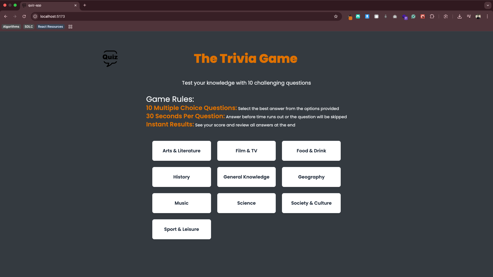
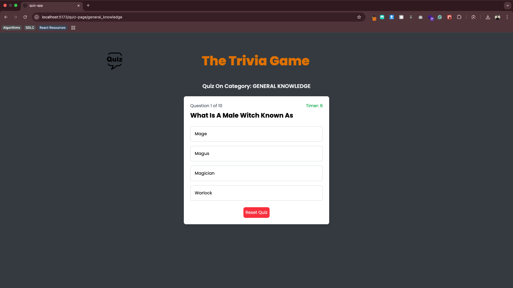
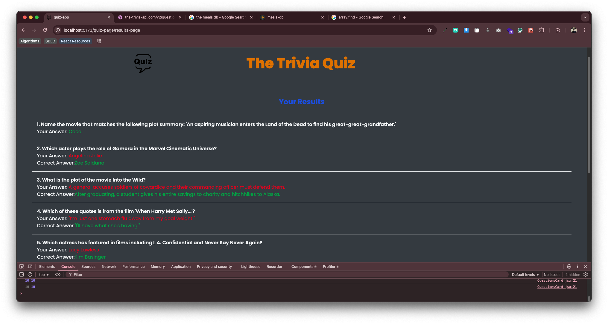

# Trivia Quiz Game

## App

## About

This app implements a simple trivia quiz game whereby a user can chose the quiz category they are interested in. Each question has a 30 seconds timer.

## Play Game

1. On the Homepage, select a category of interest.
2. Answer each question before the timer runs out
3. Preview your results upon completion

## Built With

- ReactJS
- TailwindCSS
- npm
- vercel
- Zustand
- Ky

### Prerequisites

Knowledge about JS, ReactJS, Ky, npm, vite, Zustand and tailwindcss

- Basic data structures
- Arrays
- useEffect
- Functions
- objects

## Clone Project

- To get a local copy up and running follow these simple example steps.
- Clone this repository with `git@github.com:Chu29/react-quiz-app.git` using your terminal or command line.
- Change to the project directory by entering: `cd react-quiz-app` in the terminal.

## Command line steps

- $ git clone `git@github.com:Chu29/react-quiz-app.git`
- $ `cd react-quiz-app`
